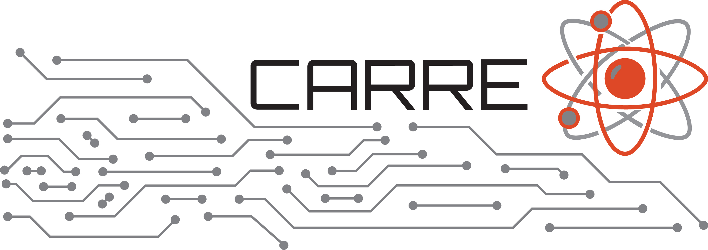

.. MC/DC documentation master file
   (homepage / index)
   Draft updated to reflect CARRE (PSAAP-IV) stewardship and CEMeNT (PSAAP-III) origins.

=================================
MC/DC: Monte Carlo Dynamic Code
=================================

MC/DC is a performant, scalable, and machine-portable Python-based Monte Carlo neutron
transport software in active development. It supports fully transient (aka dynamic) Monte Carlo
transport and is purpose-built as a rapid methods development platform for modern HPC systems
(targeting both CPUs and GPUs).

MC/DC has support for continuous energy and multi-group transport. It can solve k-eigenvalue
problems (e.g., neutron population growth rates in reactors) as well as fully time-dependent
simulations. MC/DC includes a continuous geometry movement capability to model transient
elements (e.g., control rods or pulsed experiments) beyond stepwise approximations.

Project Stewardship (PSAAP-IV)
==============================

Primary stewardship and ongoing development of MC/DC is carried out within CARRE
(Center for Advancing the Radiation Resilience of Electronics), a PSAAP-IV Predictive Simulation
Center led by Oregon State University.

MC/DC is developed openly, with contributions from the collaborating institutions listed below and
the broader community. The codebase is open-source (BSD-3-Clause) and welcomes external
contributions via GitHub.

Supported by / in coordination with
------------------------------------

Collaborating Institutions
--------------------------

Origins (PSAAP-III)
===================

MC/DC was initiated and matured during PSAAP-III as the primary software deliverable of CEMeNT
(Center for Exascale Monte Carlo Neutron Transport), an Oregon State University–led Focused
Investigatory Center with partner institutions including Notre Dame, North Carolina State University,
and Seattle University.

CEMeNT’s PSAAP-III work established MC/DC as a modern platform for transient Monte Carlo
methods research and software engineering, with an explicit goal that MC/DC continue beyond
the original PSAAP-III center timeline.

Platform & Performance Notes
============================

MC/DC is validated to run on:

* linux-64 (x86)
* win-64 (x86 windows)
* osx-64 (x86, intel based macs)
* osx-arm64 (apple silicon based macs)
* linux-ppc64 (IBM POWER9)
* linux-nvidia-cuda
* linux-amd-rocm

MC/DC has been run on large-scale HPC systems (including LLNL systems) and has been scaled
to large node counts for production-relevant research workflows.

Publications
============

Work within MC/DC has resulted in journal and conference publications. For the peer-reviewed
software paper, please cite the Journal of Open Source Software article below. A broader list of
associated publications is available via the project’s publications page(s).

.. only:: html

   --------
   Contents
   --------

.. toctree::
    :maxdepth: 1

    install
    user/index
    examples/index
    contribution/index
    theory/index
    pythonapi/index
    pubs

.. sidebar-links::
    :caption: Links
    :pypi: mcdc
    :github:

    CARRE <https://carre-psaapiv.org/>
    CEMeNT <https://cement-psaap.github.io>
    license <https://github.com/CEMeNT-PSAAP/MCDC/blob/main/LICENSE>

Indices and tables
==================

* :ref:`genindex`
* :ref:`modindex`
* :ref:`search`

To build the docs
=================

#. Install dependencies (we recommend: ``conda install sphinx`` and ``pip install furo sphinx_toolbox``).
   Note that these dependencies are not installed as part of base MC/DC.
#. From the ``MCDC/docs/`` directory, run ``make html`` to compile.
#. Launch ``build/html/index.html`` with your browser of choice.

To Cite MC/DC
=============

If you use MC/DC and would like to provide proper attribution please cite our article in the Journal of Open Source Software:

.. code-block:: bibtex

    @article{morgan2024mcdc,
        title = {Monte {Carlo} / {Dynamic} {Code} ({MC}/{DC}): {An} accelerated
                 {Python} package for fully transient neutron transport and
                 rapid methods development},
        author = {Morgan, Joanna Piper and Variansyah, Ilham and Pasmann, Samuel L. and
                  Clements, Kayla B. and Cuneo, Braxton and Mote, Alexander and
                  Goodman, Charles and Shaw, Caleb and Northrop, Jordan and Pankaj, Rohan and
                  Lame, Ethan and Whewell, Benjamin and McClarren, Ryan G. and Palmer, Todd S.
                  and Chen, Lizhong and Anistratov, Dmitriy Y. and Kelley, C. T. and
                  Palmer, Camille J. and Niemeyer, Kyle E.},
        journal = {Journal of Open Source Software},
        volume = {9},
        number = {96},
        year = {2024},
        pages = {6415},
        url = {https://joss.theoj.org/papers/10.21105/joss.06415},
        doi = {10.21105/joss.06415},
    }

If you are developing or working with specific numerical methods please take greater care to cite
the specific publications where that work is presented. A selected list can be found on our
:ref:`pubs` page.
