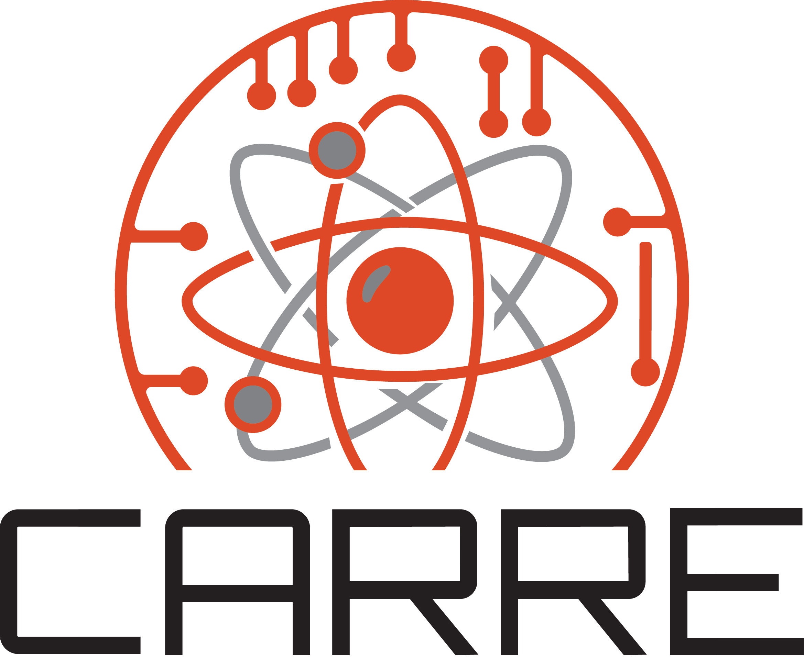

.. MC/DC documentation master file

======================================
MC/DC: Monte Carlo Dynamic Code
======================================

MC/DC is an open-source, performance-oriented Monte Carlo neutron transport code
written in Python. The code is designed for fully transient (dynamic) particle
transport simulations and serves as a platform for rapid methods development on
modern high-performance computing architectures, including both CPU and GPU systems.

The code supports continuous-energy and multigroup neutron transport for both
k-eigenvalue criticality calculations and time-dependent simulations. A distinguishing
capability is continuous geometry movement, enabling high-fidelity modeling of
transient phenomena such as control rod motion and pulsed neutron experiments without
stepwise approximations.

------------------------------
Features
------------------------------

- **Transport Modes**: Continuous-energy and multigroup neutron transport
- **Problem Types**: k-eigenvalue and fully time-dependent simulations
- **Geometry**: Continuous geometry movement for transient modeling
- **Parallelization**: Scalable execution on CPU and GPU architectures
- **Portability**: Cross-platform support including x86, ARM, POWER, CUDA, and ROCm

------------------------------
Documentation
------------------------------

.. toctree::
   :maxdepth: 1
   :caption: User Documentation

   install
   user/index
   examples/index

.. toctree::
   :maxdepth: 1
   :caption: Developer Documentation

   contribution/index
   theory/index
   pythonapi/index

.. toctree::
   :maxdepth: 1
   :caption: Reference

   pubs

-------------------
Supported Platforms
-------------------

MC/DC has been validated on the following platforms:

**Desktop and Workstation**

- Linux x86_64
- Windows x86_64
- macOS x86_64 (Intel)
- macOS ARM64 (Apple Silicon)

**High-Performance Computing**

- Linux POWER9 (IBM)
- Linux with NVIDIA CUDA
- Linux with AMD ROCm

The code has been deployed on leadership-class computing facilities including
systems at Lawrence Livermore National Laboratory.

-------------------------
Project History and Scope
-------------------------

Development Origin (PSAAP-III)
------------------------------

MC/DC was initiated during PSAAP-III as the primary software deliverable of the
Center for Exascale Monte Carlo Neutron Transport (CEMeNT), a Focused Investigatory
Center led by Oregon State University. Partner institutions included the University
of Notre Dame, North Carolina State University, and Seattle University.

.. image:: images/home/cement-logo-1.png
   :width: 400
   :alt: CEMeNT logo
   :align: center
   :target: https://cement-psaap.github.io/

CEMeNT established MC/DC as a modern platform for transient Monte Carlo methods
research with an explicit goal of continued development beyond the PSAAP-III program.

Current Stewardship (PSAAP-IV)
------------------------------

Primary stewardship and ongoing development is carried out within the Center for
Advancing the Radiation Resilience of Electronics (CARRE), a PSAAP-IV Predictive
Simulation Center led by Oregon State University.

MC/DC is developed openly under the BSD-3-Clause license. The codebase welcomes
external contributions via GitHub.

--------------------------
Collaborating Institutions
--------------------------

.. raw:: html

   

   
   
   
   
   

   

   
   
   
   

----------------
Acknowledgments
----------------

.. raw:: html

   

   
   
   
   

------------------------------
License
------------------------------

MC/DC is distributed under the BSD-3-Clause license. See the
`LICENSE <https://github.com/CEMeNT-PSAAP/MCDC/blob/main/LICENSE>`_ file for details.

------------------------------
Citation
------------------------------

If you use MC/DC in your research, please cite the following publication:

    Morgan, J.P., Variansyah, I., Pasmann, S.L., et al. (2024). Monte Carlo /
    Dynamic Code (MC/DC): An accelerated Python package for fully transient
    neutron transport and rapid methods development. *Journal of Open Source
    Software*, 9(96), 6415. https://doi.org/10.21105/joss.06415

BibTeX entry:

.. code-block:: bibtex

   @article{morgan2024mcdc,
       title   = {Monte {Carlo} / {Dynamic} {Code} ({MC}/{DC}): {An} accelerated
                  {Python} package for fully transient neutron transport and
                  rapid methods development},
       author  = {Morgan, Joanna Piper and Variansyah, Ilham and Pasmann, Samuel L. and
                  Clements, Kayla B. and Cuneo, Braxton and Mote, Alexander and
                  Goodman, Charles and Shaw, Caleb and Northrop, Jordan and Pankaj, Rohan and
                  Lame, Ethan and Whewell, Benjamin and McClarren, Ryan G. and Palmer, Todd S.
                  and Chen, Lizhong and Anistratov, Dmitriy Y. and Kelley, C. T. and
                  Palmer, Camille J. and Niemeyer, Kyle E.},
       journal = {Journal of Open Source Software},
       volume  = {9},
       number  = {96},
       year    = {2024},
       pages   = {6415},
       doi     = {10.21105/joss.06415},
   }

For publications addressing specific numerical methods, please cite the relevant
works listed on the :ref:`pubs` page.

------------------------------
Indices and Tables
------------------------------

* :ref:`genindex`
* :ref:`modindex`
* :ref:`search`

.. sidebar-links::
   :caption: External Links
   :pypi: mcdc
   :github:

   CARRE <https://carre-psaapiv.org/>
   CEMeNT <https://cement-psaap.github.io>